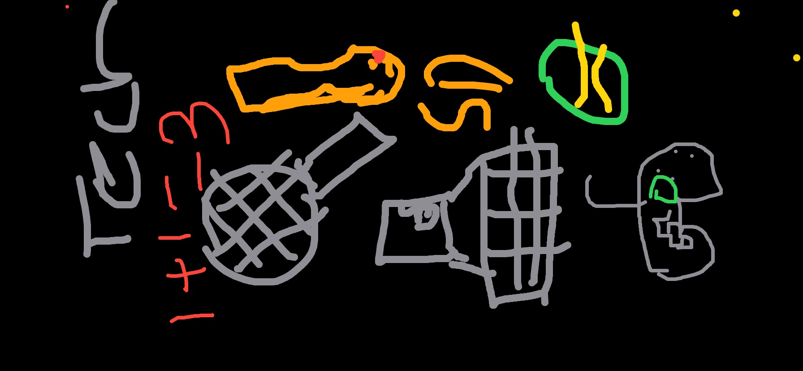

## Saathvik's Computer Science Blog
Hi! I'm Saathvik Gampa, an **aspiring computer science developer**! I am **15** years old and go to Del Norte High. I am currently in my **Sophomore** year in high school challenging myself with 3 AP courses. Here are more facts about me:
- **Member** of Del Norte High's robotics team Team Optix 3749
- DECA **Participant**
- Aspiring **Tennis Player**
- **Academically** Driven Student

For more visual viewers here is a picture of things that usually takes up most of my time :) :

### Here is a little mini game :):

    <label id = "questionLabel" for="userInput">What grade am I in?</label>
    <input type="text" id="userInput">
    <button onclick="checkInput()">Submit</button>

 

**Social** Media :  
[Github](https://github.com/SGTech08)  
[Instagram](https://instagram.com/saathvikg08)  

